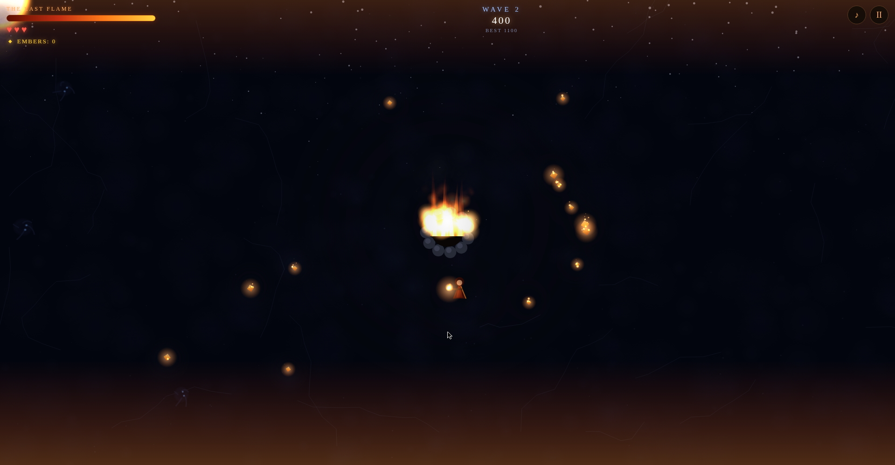

# PYREKEEPER: The Last Flame

🔥 **Play it now:** https://retroromrunner.github.io/pyrekeeper-the-last-flame/

An action-survival web game built around one obsession: **animated fire**.

You are the last Pyrekeeper, defending the Last Flame in a frozen arena at the end of the world. Frost shades converge on your hearth to snuff it out — hurl flame bolts to burn them back, gather the embers they drop, and carry them to the hearth to stoke the fire.

## The loop

- **Burn** — hurl flame bolts at the frost shades; kills drop embers
- **Feed** — carry embers back to the hearth to raise the flame
- **INFERNO** — overfeed a roaring flame to unleash a screen-filling inferno that incinerates everything on screen
- **Survive** — escalating waves, with a Frost Revenant boss every 5th wave
- **Don't fall** — lose all 3 hearts and the keeper dies; let the flame hit zero and the dark wins

## Fire tech

- Pooled particle engine (2,400 particles): additive flames, sparks, smoke, snow
- Layered bezier flame tongues on the hearth that grow and shrink with the flame level
- Animated fire overlays crawling along the top and bottom of the entire screen
- Dynamic fire lighting — a darkness layer with light holes punched by every flame
- Frost vignette creeps in as the flame dies; full-screen inferno with camera shake
- 100% procedural Web Audio: crackling fire bed, wind, whooshes, wave horns

## Controls

- **WASD / Arrows** — move · **Space** — hurl flame · **P** — pause · **M** — mute
- Mobile: virtual joystick + FIRE button

A single self-contained HTML file — no libraries, no assets. Best score is saved in your browser.
